<div align="center">



**Hides the blank console windows Windows opens for other people's processes.**
One file, no runtime, no telemetry — and nothing visible once it is running.

[](LICENSE)
[](#requirements)
[](#build-it)
[](#privacy)
[](#files)

</div>

---

Your agent goes to run something, and a blank terminal window appears on the desktop, takes focus
mid-sentence, and sits there doing nothing. Dismiss it and the next tool call opens another one.
Ternitor watches for those windows and hides them before they are ever drawn — and when one of them
manages to take focus anyway, it hands focus back to the window you were on. Every agent, every tool,
silently, from the notification area.

## Why the windows appear

Agent hosts — Claude Code, opencode, codex under T3 Code — run as **ConPTY clients, which have no
console**. Any child they spawn with default creation flags therefore gets a brand-new console, and
the Windows default-terminal broker hands that console to Windows Terminal as a visible window.

This is structural, not a bug in any one tool, and no flag on the child can prevent it: window
visibility is the **spawner's** `CREATE_NO_WINDOW` decision, and the spawners are vendored hooks and
MCP servers that cannot be edited.

One dead end, recorded so nobody repeats it: a `node` shim on `PATH` can never shadow the real one,
because `C:\Program Files\nodejs` is on Machine `PATH` and User `PATH` is appended after it.

## Quickstart

```
Ternitor-Setup.exe
```

Run it. It installs for the current user — no administrator rights — copies `Ternitor.exe` to
`%LOCALAPPDATA%\Programs\Ternitor`, adds a Start Menu shortcut, and registers an entry in
**Settings > Apps** so it can be removed like anything else. Starting with Windows is a tick box on
the last page, and the switch in Settings afterwards.

Or, from a checkout, the same install without the installer:

```
.\install.ps1
```

`install.ps1 -NoStartWithWindows -NoLaunch` if you want it installed but neither starting at sign-in
nor running yet.

Or skip all of that and run the exe where it stands. There is nothing to unpack:

```
ternitor.exe
```

Either way it starts in the notification area, hides the next blank console it sees, and stays out of
the way.

**Left-click the tray icon** for Settings. **Right-click** for Settings, Pause hiding, Open log, Exit.

To have it start at logon, open Settings and flip **Start with Windows**. That writes one value under
`HKCU\Software\Microsoft\Windows\CurrentVersion\Run`. Delete the exe and that value and nothing is
left behind. **Uninstall** in Settings > Apps stops the app and takes away the exe, the folder, the
shortcut, the `Run` value and that entry — through the installer's own uninstaller, or through
`uninstall.ps1` if it was installed with the script.

## What you get

| | |
|---|---|
| **Hides the window** | Before it paints, not after — no flash, no flicker in the taskbar |
| **Takes the focus back** | A hidden console can still activate itself; Windows Terminal wakes its handoff window again as the client attaches, seconds later, without showing anything. It is hidden again and the foreground goes back to the window that last really had it |
| **Knows the difference** | A terminal *you* opened from `Win+R` or a `wt` alias looks identical at that instant. Each hide is re-checked 600ms in and given back, without activation, only when its title is a shell's own — a directory it is sitting in, a prompt, an elevated console, or a shell by name. `npm` naming itself is not one |
| **Counts its work** | The settings screen carries a live count of what it has hidden this session, and the title of the last one |
| **Refuses to grow** | Four things on the settings screen and nothing else — a switch, the counter, app info, and a way out. Everything that is not one of those lives on the tray menu |
| **Says nothing** | No network calls, no telemetry, no update check, no crash reporting |

## How it works

```
agent spawns a child ─▶ new console, no window yet ─▶ default-terminal broker
                                                              │
                        SetWinEventHook ◀──────────────────────┘
                                │
                class is CASCADIA_HOSTING_WINDOW_CLASS?
                                │
                        owning process command line contains -Embedding?
                                │
                                ▼
                     hidden before it is drawn
                                │
        takes the foreground while hidden ─▶ hidden again,
                                             focus handed back
```

A `SetWinEventHook` on `EVENT_OBJECT_CREATE` and `EVENT_OBJECT_SHOW` watches for new windows, and one
on `EVENT_SYSTEM_FOREGROUND` watches who has focus. A window is hidden only if its **class** is
`CASCADIA_HOSTING_WINDOW_CLASS` **and** the command line of the process that owns it contains
`-Embedding` — a flag set by the default-terminal broker and nothing else, read with
`NtQueryInformationProcess`. Matching the window *title* does not work: at creation time it is still
the broker's placeholder, and only later becomes the client's path.

The foreground hook is the second half. A window that has already been hidden can be activated anyway,
which moves focus whether or not anything is on screen and leaves you typing into a window you cannot
see. Anything that does it is hidden again, and the window that last really had the foreground gets it
back.

Event-driven, no polling, and a terminal you opened yourself is never touched.

## Settings

The settings window is the app's only surface, opened from the tray and perhaps once a session. It
carries four things and refuses to carry a fifth: **Start with Windows**, a live count of the windows
hidden this session, app info, and **Quit**, which ends the process completely — the same thing the
tray menu's *Exit* does, for when the icon is hard to find.

Everything else stays on the tray menu, because a utility whose value is *not being noticed* should
not grow a control panel.

What it looks like is documented in [DESIGN.md](DESIGN.md). The surface is a bench instrument panel —
a mechanical counter, a switch, a grease pencil — and the counter is the only number on it, because
the count is the whole of what Ternitor produces.

## Requirements

- **Windows 11, x64.** No runtime, no redistributable, no Node. PowerShell only for the installer,
  which you can skip.
- **Windows only.** The windows it hides are made by Windows, and `janitor.rs` has nothing to port:
  the detection is Windows' own window classes and the broker's `-Embedding` flag. Nothing here builds
  for Linux or macOS.
- **567 KB.** One exe, most of it the icon. Nothing is written outside its own folder and the
  registry values you can see and delete.
- **Nothing at startup.** The build is a GUI-subsystem binary (PE subsystem 2), so it can never
  allocate a console — which is what stops it flashing one of its own at logon. An earlier scripting
  version needed a `wscript` shim and a headless `conhost` to achieve the same thing; a compiled app
  gets it for free.
- **No GPU, no service, no scheduled task, no driver.**

## Privacy

Nothing leaves the machine. There is no network code in the binary at all — no telemetry, no
analytics, no update check. The one file it writes is `ternitor.log` beside the exe: every hide, every
re-show, every focus taken back, every toggle. Read it, or delete it while the app is running.

The full accounting of what it reads and writes is in [PRIVACY.md](PRIVACY.md).

## Build it

```
cargo build --release
```

Rust 2021, one dependency (the `windows` crate). The binary lands at `target\release\ternitor.exe`.

The `ternitor.exe` committed here is that build copied up, so it goes stale whenever `src/` moves.
Rebuild before trusting it.

The installer needs Inno Setup 6 (`winget install JRSoftware.InnoSetup`). It ships the exe from the
repo root, not one out of `target\release`, and takes the version and the icon off that exe so neither
can drift from what it ships:

```
copy target\release\ternitor.exe .\ternitor.exe
.\installer\build.ps1
```

That writes `Ternitor-Setup.exe` beside it.

## Files

| File | |
|---|---|
| `ternitor.exe` | the app; run it directly |
| `Ternitor-Setup.exe` | the installer: the same per-user install in one double-clickable file |
| `ternitor.log` | created next to the exe on first run |
| `install.ps1` / `uninstall.ps1` | per-user install and removal, no administrator rights |
| `installer/` | the Inno Setup script behind `Ternitor-Setup.exe`, and the script that builds it |
| `src/` | `janitor.rs` detection, `ui.rs` the settings surface, `tray.rs` the icon |
| `src/mark.rs` | the app mark: the one definition of the icon, which `build.rs` bakes into the exe |
| `assets/readme/` | the animated header on this page, as SVG |
| `assets/icon.svg` | the app icon, generated from `src/mark.rs` |

## Moving it

The folder is self-contained and location-independent — the log is written beside the exe rather than
under AppData, and nothing stores an absolute path. Copy it anywhere.

If **Start with Windows** is on, flip it off and on again from the new location so the `Run` value
points at the copy you kept.

## Documentation

- [DESIGN.md](DESIGN.md) — the settings surface: palette, type, layout, and the rules behind them
- [PRODUCT.md](PRODUCT.md) — what the product is for, and what it deliberately does not do
- [PRIVACY.md](PRIVACY.md) — everything it reads and writes, and where
- [TERMS.md](TERMS.md) — plain-language terms; the MIT licence is the document that binds

## License

MIT. See [LICENSE](LICENSE).

<div align="center">
<sub>The counter is the only thing it ever shows you. That is the point.</sub>
</div>
